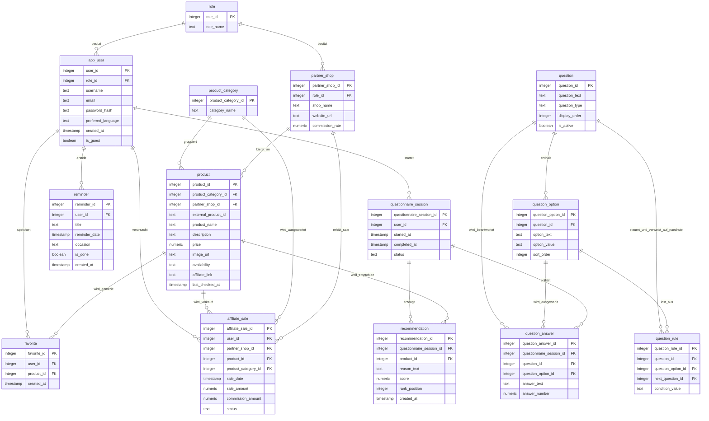

# GiftGuide ER-Modell

Das Diagramm zeigt die wichtigsten Entitäten der GiftGuide-Datenbank. Im Zentrum stehen der Fragebogen, die daraus entstehenden Empfehlungen und die Produkte aus Partner-Shops.
